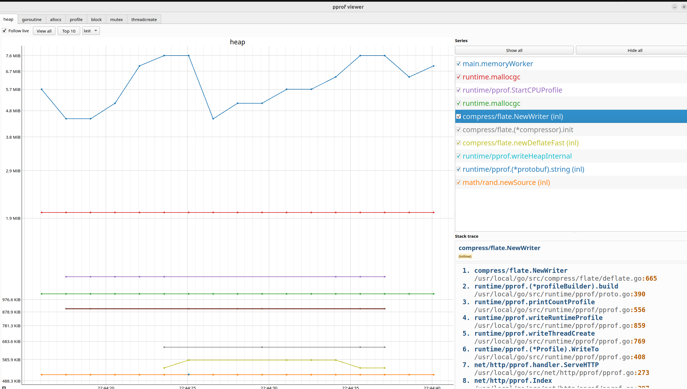

# live pprof viewer

Лёгкий live viewer для Go `pprof`.

Проект состоит из двух частей:

- backend на Go, который опрашивает `pprof` у целевого приложения и отдаёт:
  - `GET /events` для SSE-обновлений
  - `GET /stack` для кадров стека
  - `GET /labels` для служебных labels отчёта
  - `GET /health` для проверки готовности
- desktop UI на PyQt, который подписывается на SSE-поток и показывает live-графики для `heap`, `goroutine`, `allocs`, `profile`, `block`, `mutex` и `threadcreate`.



## Требования

- Go
- Python 3
- `pip`

Установка зависимостей UI:

```bash
python3 -m venv .venv
source .venv/bin/activate
python -m pip install -r requirements.txt
```

В `requirements.txt` лежат `PyQt5`, `pyqtgraph`, `humanize` и `requests`, которые используются UI-частью.

## Ручной запуск

Запускай части приложения в отдельных терминалах.

### 1. Запусти целевое приложение с `pprof`

Для локальной демонстрации можно в первом терминале запустить пример нагрузки из `cmd/dummy`:

```bash
go run ./cmd/dummy
```

Этот dummy-процесс поднимает `pprof` на `http://localhost:6060` и создаёт CPU-, memory- и goroutine-нагрузку, чтобы viewer сразу показывал живые данные. В примере подключён `net/http/pprof`, запускается HTTP-сервер на `localhost:6060`, включается block и mutex profiling, а также стартуют фоновые worker'ы.

### 2. Запусти backend

Во втором терминале запусти backend и передай ему base URL `pprof` целевого приложения:

```bash
go run ./cmd/app 127.0.0.1:8080 http://localhost:6060
```

Backend принимает два позиционных аргумента:

1. адрес, на котором он слушает, например `127.0.0.1:8080`
2. base URL `pprof`, например `http://localhost:6060`

### 3. Запусти UI

В третьем терминале запусти desktop UI и передай ему base URL backend'а:

```bash
python main.py http://127.0.0.1:8080
```

Если аргумент не передан, UI по умолчанию использует `http://127.0.0.1:8080`.

## Примечания

- Backend публикует flat values по функции и строке через SSE.
- При выборе серии в UI загружается и показывается её stack trace.
- URL backend'а по умолчанию для UI — `http://127.0.0.1:8080`.
